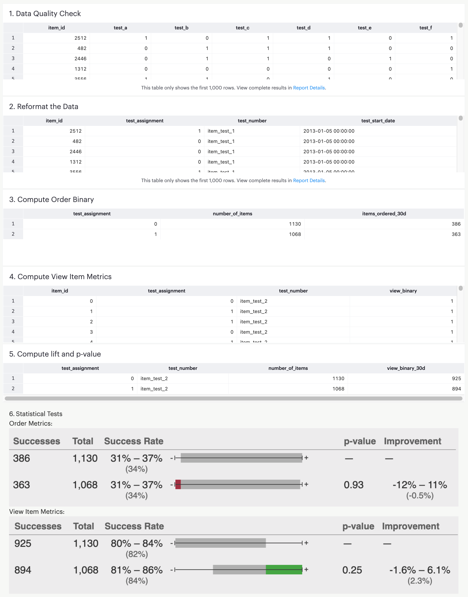

# A/B testing with SQL
This repository contains the code for the final assignment in Coursera course:
https://www.coursera.org/learn/data-wrangling-analysis-abtesting/
Each question is split into a separate .sql file, where the goal is to clean data, separate by control and experimental groups, and evaluate metrics using statistical testing using a binomial distribution.

The final tables are summarized in the following screenshot:

  

